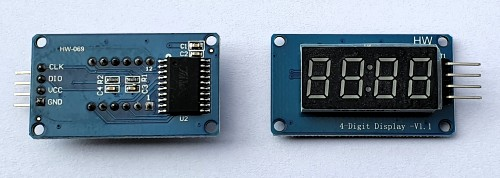

# TM1637 Seven-Segment Display (4-digit and 6-digit)

!!! failure "This feature is not included in precompiled binaries, except tasmota(32)-display.bin"     

To use it (i.e., if you're not using tasmota(32)-display.bin precompiled binary), you must [compile your build](Compile-your-build) after adding the following to `user_config_override.h`:
```
#ifndef USE_DISPLAY
#define USE_DISPLAY
#endif

#ifndef USE_DISPLAY_TM1637
#define USE_DISPLAY_TM1637
#endif
```
----

<br>


The **TM1637** display module is a small (~ 10mm high digits) 7-segment, LED-based display unit with 4 or 6 digits. It uses a two-wire I2C-like (but not exactly) protocol for communication with MCUs. This module is a great way to add a simple numeric display to any MCU project.

## Features
* The Tasmota support for this module enables the display of numbers (both integers and floats) and basic text. For example, sending the text "22.5^" displays "22.5°"

* Raw segments can also be displayed.

* It is also possible to set brightness (8 levels), clear the display, scroll text, display a rudimentary bar graph, and a Clock (12 hr and 24 hr).

* Additionally, for the TM1638, it allows the onboard LEDs to be toggled using its buttons. Useful STAT messages are also sent when the TM1638 buttons are pressed.


## Configuration

### Wiring
The TM1637 module needs two GPIO pins and a 3.3V-5V power supply. 

| TM1637   | ESP8266 based module |
|---|---|
|CLK   | GPIOx   |
|DIO   | GPIOy 
|VCC   | 3.3V (e.g., ESP-01) or 5V (e.g., Wemos D1 Mini)
|GND   | GND


### Tasmota Settings 
In Tasmota's **_Configuration -> Configure Module_** page assign:

1. GPIOx to `SSPI SCLK`
2. GPIOy to `SSPI MOSI`


For example, if x=3 and y=4, then the configuration would look like the following:


!!! failure "Note that you need to select the **SSPI** pins and NOT *SPI*" 


Once the GPIO configuration is saved and the ESP8266/ESP32 module restarts, set the Display Model to 15 using the command "DisplayModel 15"

  After this, depending upon your display variant, set your Display Type to 0, 1 or 2 using the command

     "DisplayType 0"  // for the 4-digit TM1637  OR
     "DisplayType 1"  // for the 6-digit TM1637  OR
     "DisplayType 2"  // for the 8-digit TM1638


  After the ESP8266/ESP32 module restarts again, the following "Display" commands can be used:


## Commands and Use

 Console Commands    | Description                                             | values     |
---------------------|---------------------------------------------------------|------------|
 DisplayType         | Sets the display type to one of TM1637 4-Digit (0), TM1637 6-Digit (1), or TM1638 (8-digit) (2)                              | 0/1/2
 DisplayClear     | Clears the display  | 
 DisplayNumber     | Clears and then displays number without decimal. command e.g., "DisplayNumber 1234". <br> Control `leading zeros`, `length` and `position`. <br> `leading zeros` can be `1` or `0` (default), `length` can be `1` to `NUM_DIGITS` (4 or 6), <br> `position` can be `0` (left-most) to `NUM_DIGITS` (right-most).  <br> Command example: `DisplayNumber 12, 1, 1, 3`  This will display `[ 012]` |    `num` [, `position`[, `leading_zeros`[, `length`]]]
 

<br><br>

## TM1637 Images

<br>
The TM1637 4-digit module (back and front):



